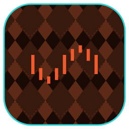

  

# unraid

Unraid is a NAS/virtualization OS with a flexible array, Docker, and VM support.

A first-party [orca](https://github.com/argyle-labs/orca) plugin (appliance integration).

This plugin **connects orca to an existing unraid install** — there's nothing to deploy here. Stand up unraid from the upstream project, then point orca at it.

---

## Run it without orca

Install unraid per the upstream project: <https://unraid.net/>. It listens on port `443` by default; this plugin talks to that endpoint (host, credentials/token) — no container is deployed.

## With orca

orca talks to a live Unraid host through its **GraphQL API** (typed queries, no opaque JSON). The plugin is a **hybrid**: a small tool surface plus one registered domain backend.

**Tool surface** (`unraid.*`):

| Command | What it does |
| --- | --- |
| `unraid.list` / `unraid.detail` / `unraid.create` / `unraid.update` / `unraid.delete` | Endpoint registry — register the Unraid hosts orca reads (base URL, `x-api-key`, self-signed TLS). The API key is stored secret-side. |
| `unraid.schema` | Inspect the embedded GraphQL schemas, pull a fresh introspection from a live host, or check drift between live and committed. |
| `unraid.<operation>` | **Auto-generated, one per GraphQL operation** — e.g. `unraid.array_status`, `unraid.shares`, `unraid.docker_containers`, `unraid.installed_plugins`, `unraid.parity_history`, `unraid.add_plugin`, `unraid.remove_plugin`. Args carry the operation's typed variables; the return is its typed response. Mutations require `role = "admin"`. See below. |

### Auto-generated operation tools

Every `.graphql` operation in `queries/` becomes an `#[orca_tool]` at build time (`build/surface.rs` walks the codegen'd query modules). Add a `.graphql` file → a new typed tool appears next build; nothing is hand-wired. Query operations surface as read tools, mutations as `role = "admin"` tools, and the full request/response shape is runtime-introspectable via each tool's arg/output JSON Schema.

Each tool resolves its connection in this order: an explicit `from` + `api_key` override wins; otherwise the named `endpoint` from the registry; otherwise, the sole registered endpoint when exactly one exists.

**Topology backend** — a `topology` collector (registered via the toolkit's `topology_backend_def`) emits one `container` claim per Docker workload per enabled endpoint, so Unraid hosts and the containers they run surface in orca's systems graph. The GraphQL API is the read path because Unraid's Docker socket is `root:docker`-only.

Because the client pins a committed schema per Unraid version, it detects **schema drift**: when a live host's introspection diverges from the embedded schema (or its version has no committed schema at all), it warns once per host so stale generated queries surface early.

### Get an API key

Mint one on the host — `unraid-api apikey --create --name "orca collector"` — or in the web UI under **Settings → Management Access → API Keys**. It is sent as the `x-api-key` header (the GraphQL endpoint ignores `Authorization: Bearer`).

## Layout

- `src/lib.rs` — typed GraphQL client facade (per-version schema routing, drift detection).
- `src/endpoint.rs` — `#[endpoint_resource]` registry: the `unraid.{list,detail,create,update,delete}` tools.
- `src/tools.rs` — the `unraid.schema` tool (pull / drift-check).
- `src/topology.rs` — the `TopologyClaim` collector (Docker workloads via GraphQL).
- `src/registration.rs` — advertises the `topology` backend and dispatches its `collect_claims` op.
- `src/schema_pull.rs` / `src/version.rs` — introspection pull + version parsing.
- `schemas/` + `queries/` — committed introspection JSON and `.graphql` queries, codegenned by `build.rs`.
- `assets/` — plugin icon.
