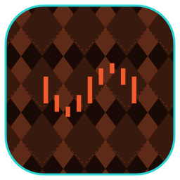

<p align="center">
  
</p>

# unraid

Unraid is a NAS/virtualization OS with a flexible array, Docker, and VM support.

A first-party [orca](https://github.com/argyle-labs/orca) plugin (appliance integration).

This plugin **connects orca to an existing unraid install** — there's nothing to deploy here. Stand up unraid from the upstream project, then point orca at it.

---

## Run it without orca

Install unraid per the upstream project: <https://unraid.net/>. It listens on port `443` by default; this plugin talks to that endpoint (host, credentials/token) — no container is deployed.


## With orca

orca talks to a live Unraid host through its **GraphQL API** (typed queries, no opaque JSON). The plugin is a **hybrid**: a small tool surface plus one registered domain backend.

**Tool surface** (`unraid.*`):

| Command | What it does |
| --- | --- |
| `unraid.list` / `unraid.detail` / `unraid.create` / `unraid.update` / `unraid.delete` | Endpoint registry — register the Unraid hosts orca reads (`--route`s, `--api-key`, self-signed TLS). The API key is stored in the secrets domain (`unraid.<endpoint>.api_key`), never on the endpoint row. |
| `unraid.schema` | Inspect the embedded GraphQL schemas, pull a fresh introspection from a live host, or check drift between live and committed. |
| `unraid.<operation>` | **Auto-generated, one per GraphQL operation** — e.g. `unraid.array_status`, `unraid.shares`, `unraid.docker_containers`, `unraid.parity_history`. Args carry the operation's typed variables; the return is its typed response. Mutations require `role = "admin"`. See below. |
| `unraid.plugins` / `unraid.installed_plugins` / `unraid.add_plugin` / `unraid.remove_plugin` / `unraid.install_plugin` / `unraid.plugin_install_operations` | **Plugin management** over the Unraid plugin manager: list (with versions), add, remove, and install/update by `.plg` URL. `unraid.install_plugin` with `forced: true` is the update path — because the plugin manager runs as root and owns the USB `/boot` write, routing orca's **own** update through it is what makes a self-update survive reboot (vs. the unprivileged daemon, which can't write flash). Installs are async — poll `unraid.plugin_install_operations` for `QUEUED → RUNNING → SUCCEEDED`. |
| `unraid.docker.status` / `unraid.docker.set_icon` / `unraid.docker.adopt` | **Unraid-native Docker containers** on the host the plugin runs on — see below. |

### Auto-generated operation tools

Every `.graphql` operation in `queries/` becomes an `#[orca_tool]` at build time (`build/surface.rs` walks the codegen'd query modules). Add a `.graphql` file → a new typed tool appears next build; nothing is hand-wired. Query operations surface as read tools, mutations as `role = "admin"` tools, and the full request/response shape is runtime-introspectable via each tool's arg/output JSON Schema.

Each tool resolves its connection in this order: an explicit `from` + `api_key` override wins; otherwise the named `endpoint` from the registry; otherwise, the sole registered endpoint when exactly one exists.

A registered endpoint is addressed by its `routes`, tried in order (enabled ones only, last-good first). An endpoint with no routes at all is treated as colocated and reached on loopback (`http://127.0.0.1`, nginx in front of the API's unix socket) — only when this host is itself Unraid (`/var/local/emhttp/var.ini` exists); otherwise resolution errors. An endpoint whose routes are all disabled or not URL-addressable errors rather than falling back to loopback. The `csrf_token` from `var.ini` is sent as `x-csrf-token` alongside `x-api-key` only when the resolved URL is loopback. Endpoint names must match `^[A-Za-z0-9_-]{1,64}$`.

```sh
orca unraid.create --name tower --api-key "$KEY"                                  # colocated
orca unraid.create --name tower --api-key "$KEY" --route lan_v4=http://10.0.0.5   # remote
orca unraid.update --name tower --api-key "$NEW_KEY"                               # rotate the key
```

### Unraid-native Docker containers

A container created with `docker run` or compose shows as "3rd Party" in Unraid's Docker tab. These verbs run on the Unraid host itself and drive the local `docker` CLI plus dockerMan's own PHP renderer (`xmlToCommand`, with the same setup as `scripts/rebuild_container`).

- `unraid.docker.status` (read-only) — per container: whether `my-<name>.xml` exists, the `net.unraid.docker.managed` label, the icon (and whether it is an argyle-labs repo icon), autostart membership, and the docker volumes it mounts; plus host-wide dangling volume/image counts.
- `unraid.docker.set_icon --name <c> --repo <r>` — for a container already managed by dockerMan: sets its template's `<Icon>` to `<icon_base>/<r>/raw/branch/main/assets/icon-256.png`, renders the patched template and refuses unless it reproduces the live container, rebuilds keeping the running/stopped state and autostart, verifies, and refreshes both icon caches.
- `unraid.docker.adopt --name <c> [--repo <r>] [--migrate-volumes] [--autostart <bool>]` — builds a template from `docker inspect` (ports, env minus image-baked values, effective `TZ`, binds, named volumes, GPU requests, hostname, tmpfs, log options, restart policy, pids limit, labels, non-default bind propagation as `--mount`), renders it, and **refuses unless the rendered command reproduces the live container**. Differences that come with moving under dockerMan are listed as `intendedChanges` (`--pids-limit 2048`, a dropped restart policy, a docker-default hostname, a compose network → `bridge`); anything else, and any inspect key the template cannot carry (capabilities, devices, healthcheck or stop-signal overrides, resource limits, static IPs, aliases, …), blocks. It also refuses when the image tag no longer resolves to the image the container runs, when another template claims the name, when a compose network is shared with other containers, and when the container is already dockerMan-managed (use `set_icon`).

  On execute it saves the original inspect to `my-<name>.xml.inspect-<date>.json`, backs up any existing template to `my-<name>.xml.bak-<date>`, writes the template (marked `<!-- managed-by: orca -->`), sets autostart so `rebuild_container` leaves the container in its previous running/stopped state, rebuilds, and verifies it is `dockerman`-managed, on the same image, and matches the rendered command. It then removes only what the container owned: its own anonymous volumes and its previous image once unused, its compose `<project>_default` network, and its compose stack directory (moved to `<root>-retired/<name>-compose-<date>` when it sits directly under a configured stacks root, has a compose file for the project, and nothing else uses or mounts it). A failure before the rebuild rolls back what that run changed; a failure after it reports a concrete recovery command.

  `--migrate-volumes` requires plain `local` volumes used by no other container; it stops the container, copies each volume's `_data` into `/mnt/user/appdata/<name>/<suffix>` with `cp -a`, verifies entries, bytes and a manifest digest, mounts those paths instead, and removes the old volumes once the recreated container is running.

`set_icon` and `adopt` are **dry-run by default**: without `--execute` they return the template XML, the rendered command, the fidelity diff, intended changes, blockers and the ordered step list, and change nothing. `--execute` requires an admin caller. Env values whose name looks secret (`pass`, `token`, `secret`, `key`, `auth`, `cred`, `cookie`, `session`, `private`) are shown as `<redacted:…>` in every output and written with `Mask="true"`.

The icon base must be `https` on an allowlisted host (`gitea.scottkey.me`, plus any in `ORCA_UNRAID_ICON_HOSTS`). Extra stacks roots (besides `/opt/stacks` and `/mnt/user/appdata/dockge/stacks`) are read from `/boot/config/plugins/orca/unraid-stacks-roots`.

**Root access.** Writing `/boot` templates and the autostart file, rebuilding, clearing icon caches, copying volumes and retiring stacks need root; the plugin runs as the unprivileged `orca` user. These effects are a closed set of operations that `unraid --privileged-op` runs as root, re-validating every input. They are reached directly when the plugin already runs as root, or through orca's privileged seam `sudo -n $ORCA_BIN admin plugin-apply` (argyle-labs/orca#762) when `ORCA_BIN` is set. With neither, execute is blocked up front.

**Topology backend** — a `topology` collector (registered via the toolkit's `topology_backend_def`) emits one `container` claim per Docker workload per enabled endpoint, so Unraid hosts and the containers they run surface in orca's systems graph. The GraphQL API is the read path because Unraid's Docker socket is `root:docker`-only.

Because the client pins a committed schema per Unraid version, it detects **schema drift**: when a live host's introspection diverges from the embedded schema (or its version has no committed schema at all), it warns once per host so stale generated queries surface early.

### Get an API key

Mint one on the host — `unraid-api apikey --create --name "orca collector"` — or in the web UI under **Settings → Management Access → API Keys**. It is sent as the `x-api-key` header (the GraphQL endpoint ignores `Authorization: Bearer`).

## Layout

- `src/lib.rs` — typed GraphQL client facade (per-version schema routing, drift detection).
- `src/endpoint.rs` — `#[endpoint_resource]` registry (`unraid.{list,detail,create,update,delete}`) and route + secret resolution into a client `Config`.
- `src/tools.rs` — the `unraid.schema` tool (pull / drift-check).
- `src/docker_adopt/` — the `unraid.docker.*` verbs: inspect → template mapping, dockerMan command parsing + fidelity diff, leftover selection and secret masking (pure, tested against real fixtures), the host side effects, and the root-only operations behind `--privileged-op`.
- `src/topology.rs` — the `TopologyClaim` collector (Docker workloads via GraphQL).
- `src/registration.rs` — advertises the `topology` backend and dispatches its `collect_claims` op.
- `src/schema_pull.rs` / `src/version.rs` — introspection pull + version parsing.
- `schemas/` + `queries/` — committed introspection JSON and `.graphql` queries, codegenned by `build.rs`.
- `assets/` — plugin icon.
